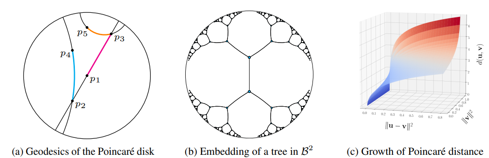

```{r setup, echo=FALSE, results="hide"}
knitr::opts_chunk$set(tidy = FALSE,
                      cache = FALSE,
                      dev = "png",
                      message = FALSE, error = FALSE, warning = FALSE)
```	

1. [Introduction](#introduction)
    i) [What is the Poincaré Embedding?](#concept)
    ii) [Previous implementation in other languages](#prev)
2. [Quick Start](#implementation)
    i) [Installation](#install)
    ii) [Data Preparation](#data)
    iii) [Example](#example)
3. [Detailed explanation about the content and the source code](#paper)
    i) [The embedding space : Poincaré ball](#ball)
        - [function : getPoincareDistanceVec](#disvec)
        - [function : getPoincareDistance](#dis)
    ii) [Optimization](#optim)
        - [function : dataLoader](#loader)
        - [function : getDistanceGradVec](#grad)
        - [function : project](#proj)
        - [function : embeddingTrainer](#trainer)
    iii) [Evaluation metric](#eval)
          - [function : averagePrecision](#AP)
          - [function : performanceScores](#score)
        
4. [Reference](#ref)

## Introduction{#introduction}
### What is the Poincaré Embedding? {#concept}

The Poincaré Embedding is concerned with the problem of learning hierarchical structure on the dataset. Phylogenetic tree or the tree of hypernymy are the examples of hierarchical structure dataset. The embedding space is a Poincaré ball, which is an unit ball equipped with poincaré distance. An advantage using Poincaré space compared to the Euclidean space as embedding space is that this space preserve tree-shaped structure well in relatively low dimension. This is because poincaré distance is intuitively continuous version of distance on tree-shaped dataset. We can take advantage of this property to make better visualization of tree-shaped dataset and provide efficient embeddings with comparably less dimensionality.

### Previous implementation in other languages {#prev}

There are several implementations on this algorithm written in python and C++. You could refer [facebookresearch](https://github.com/facebookresearch/poincare-embeddings) for python or [TatsuyaShirakawa](https://github.com/TatsuyaShirakawa/poincare-embedding) for C++. To the best of my knowledge,  it is not yet done on R.

## Quick Start {#implementation}

### Installation {#install}

```{r}
# loading package "poincare.embeddings"
require(devtools)
devtools::install_github("hwchang1201/poincare.embeddings")
library(poincare.embeddings)
```

### Data Preparation {#data}

You should provide tree-structured dataset that you want to embed as an input in the main function. The data can be provided with either using .yaml format file or programmatical way by installing the package named "data.tree". This explanation and examples are from Introduction to [data.tree](https://cran.r-project.org/web/packages/data.tree/vignettes/data.tree.html#trees-in-r).

1. Create a tree from a yaml file.

Here is an example that can be an input of the model.

```{r}
#loading package "yaml" and "data.tree".
library(yaml)
library(data.tree)
# making a yaml structure code.
acme <- "
name: acme Inc.
Accounting:
  New Software:
    leaf:
  New Accounting Standards:
    leaf:
Research:
  New Product Line:
    leaf:
  New Labs:
    leaf:
IT:
  Outsource:
    leaf:
  Go agile:
    leaf:
  Switch to R:
    leaf:
"
# make yaml format as an input.
acme_yamlDataset <- yaml::yaml.load(acme)
# Or make yaml file as an input.
# acme_yamlDataset <- yaml::read_yaml("./acme.yaml") # you should have a yaml file "acme.yaml""

# then convert into tree structure.
acme_treeDataset <- data.tree::as.Node(acme_yamlDataset)
print(acme_treeDataset)
```

2. Create a tree programmatically.

```{r}
# loading package "data.tree".
library(data.tree)

# defining tree structured dataset.
acme_treeDataset <- Node$new("Acme Inc.")
  accounting <- acme_treeDataset$AddChild("Accounting")
    software <- accounting$AddChild("New Software")
    standards <- accounting$AddChild("New Accounting Standards")
  research <- acme_treeDataset$AddChild("Research")
    newProductLine <- research$AddChild("New Product Line")
    newLabs <- research$AddChild("New Labs")
  it <- acme_treeDataset$AddChild("IT")
    outsource <- it$AddChild("Outsource")
    agile <- it$AddChild("Go agile")
    goToR <- it$AddChild("Switch to R")

print(acme_treeDataset)
```

### Example {#example}


```{r}
# loading package "poincare.embeddings"
library(poincare.embeddings)
# use example dataset
# 1. use "toy"
toy_yaml <- yaml::yaml.load(toy)
toy_tree <- data.tree::as.Node(toy_yaml)
emb <- poincareEmbeddings(toy_tree, theta_dim = 2, N_epoch = 200, lr = 0.005, n_neg = 10)

print(paste("The ranking of the poincare embedding :", emb$rank))
print(paste("The mean average precision of the poincare embedding :", emb$map))
```

```{r}
# 2. use "statistics"
statistics_yaml <- yaml::yaml.load(statistics)
statistics_tree <- data.tree::as.Node(statistics_yaml)
emb <- poincareEmbeddings(statistics_tree, theta_dim = 2, N_epoch = 200, lr = 0.005, n_neg = 10)

print(paste("The ranking of the poincare embedding :", emb$rank))
print(paste("The mean average precision of the poincare embedding :", emb$map))
```

```{r}
# 3. use "statistics_adv"
statistics_adv_yaml <- yaml::yaml.load(statistics_adv)
statistics_adv_tree <- data.tree::as.Node(statistics_adv_yaml)
emb <- poincareEmbeddings(statistics_adv_tree, theta_dim = 2, N_epoch = 200, lr = 0.005, n_neg = 10)

print(paste("The ranking of the poincare embedding :", emb$rank))
print(paste("The mean average precision of the poincare embedding :", emb$map))
```

## Detailed explanation about the content and the source code {#paper}

In this chapter, I will elaborate on the content of the paper aligned with my source code. 

### The embedding space : Poincaré ball {#ball}

The Poincaré ball is one of the instants in the hyperbolic geometry. Hyperbolic geometry is a non-Euclidean geometry concerned with constant negative curvature. To be specific, the Poincaré ball is an unit ball $\mathcal{B}^d$ equipped with constant curvature -1, which is equivalent to have the distance metric $d$ such that

$$
d(u, v) = arcosh(1 + 2\frac{\|u-v\|^2}{(1-\|u\|^2)(1-\|v\|^2)})
$$

Hyperbolic spaces have received attention to model hierarchical data as they can be regarded as continuous version of discrete tree-structure space. Let's take a look at the pictures below to see what it means.

<p align="center">
<br>
</p>

Figure (a) shows us that how the geodesic of Poincaré disk looks. In particular, the geodesic between point 3 and 5 seems pits in the direction of the origin. This means the distance between sibling nodes is approximately sum of the distance between parent node and each child node, which corresponds to the discretized metric of tree-structure data. Figure (b) shows the efficacy of embeddings. Suppose each parent node has the same number of child nodes. Then the number of children grows exponentially with their distance between the root node. This can be handled in hyperbolic geometry because hyperbolic disc area and circle length grow exponentially with their radius. The paper clarifies that this cannot happen in Euclidean space because only remedy for this exponential increase is increasing dimension of the space, which cause computational problem both memory and runtime issue. Finally, figure (c) shows trend of the Poincaré distance relative to the Euclidean distance and the Euclidean norm of one node. 

#### function : getPoincareDistanceVec{#disvec}

This function is implementation of the Poincare distance between two vectors. The expression below is what 'getPoincareDistanceVec' does.
$$
d(\theta_i, \theta_j) = arcosh(1 + 2\frac{\|\theta_i-\theta_j\|^2}{(1-\|\theta_i\|^2)(1-\|\theta_j\|^2)})
$$

The code below calculates Poincare distance between (0, 0) and (0.1, 0.5)

```{r}
getPoincareDistanceVec(c(0, 0), c(0.1, 0.5))
```


#### function : getPoincareDistance{#dis}

This function is implementation of the Poincare distance over matrix whose rows are vector in $\mathcal{B}^d$. The output is N by N matrix with the number of entities N.

$$
d(\Theta)_{ij} = d(\theta_i,\theta_j)
$$
For example, the code below calculates Poincare distance over matrix.

```{r}
getPoincareDistance(matrix(c(0, 0, 0.1, 0.5), 2, 2, byrow = TRUE))
```

### Optimization {#optim}

Now given the tree-structured dataset $\mathcal{S} = \{x_i\}_{i=1}^n$, we want to embed or make numeric proxy of the each entity $\Theta = \{\theta_i\}_{i=1}^n$ on the numeric embedding space ($\mathcal{B}^d$, $d(*, *)$). The reason we use the space with negative one curvature is that it is the easier space to optimize than any other space equipped with negative curvature other than negative one.

Now Here is our objective function of $\Theta$.

$$
\mathcal{L}(\Theta) = \sum_{(u,v)\in\mathcal{D}} log \frac{e^{-d(u,v)}}{\sum_{v'\in \mathcal{N}(u)} e^{-d(u,v')}}
$$
Where positive relation set to be $\mathcal{D} = \{(u,v)\}$, i.e. $u$ is direct parent node of $v$ and  negative relation set to be $\mathcal{N}(u) = \{u |(u,v) \notin \mathcal{D}\} \cup \{u\}$, i.e.$v$ is not related to $u$ and including itself. This equation can be interpreted as a soft ranking loss where related objects should be closer than objects that are not related to each other. In detail, the author picks only 10 samples from each negative relation set $\mathcal{N}(u)$. I put this as a hyperparameter, 'n_neg' in the source code.

#### function : dataLoader {#loader}
This function is making positive relation set $\mathcal{D}$(POS) and negative relation set $\mathcal{N}$(NEG) out of the tree-structured dataset(data.tree) as explained above. On top of that this function gives the entity names(entity) required for 2D-only plotting.

```{r}
toy_yaml <- yaml::yaml.load(toy)
toy_tree <- data.tree::as.Node(toy_yaml)
print(toy_tree)
dataLoader(toy_tree)
```

the Next thing to consider in optimization is the optimization method. Since the Poincare ball has a Riemannian manifold structure, we can use Stochastic Riemannian optimization methods, which the Riemannian gradient of $\mathcal{L}(\theta)$ (we denote it as $\nabla_R$) plays the role instead of the Euclidean gradient $\nabla_E$

Then the update of this gradient method is
$$
\theta_{t+1} = \mathcal{R}_{\theta_t}(-\eta_t\nabla_R \mathcal{L}(\theta_t)) = \theta_t -\eta_t\nabla_R \mathcal{L}(\theta_t) 
$$
where $\mathcal{R}_{\theta}$ retraction onto the ball at $\theta$. and $\eta_t$ is learning rate at time $t$. This paper uses $\mathcal{R}_{\theta}(v) = \theta + v$ as above, 

On the other hand, ($\mathcal{B}^d$, $d(*, *)$) is equivalent to ($\mathcal{B}^d$, $g_x$) where $g_x$ is Riemannian metric tensor on $x \in \mathcal{B}^d$. We can get
$$
g_x = (\frac{2}{1-\|x\|^2})^2 g^E
$$
where $g^E$ is Euclidean metric tensor. By this fact, we can get
$$
\theta_{t+1} = \theta_t -\eta_t\nabla_R \mathcal{L}(\theta_t) = \theta_t -\eta_t(\frac{(1-\|x\|^2)^2}{4})\nabla_E \mathcal{L}(\theta_t)
$$

#### function : project {#proj}
Since our embedding space is unit ball, we don't want any parameters $\theta$ to have more than 1 in terms of Euclidean norm, i.e. $\| \theta \| \leq 1$. This function plays this role.

$$
project(\theta) =
\begin{cases}
\theta /\| \theta \| - \epsilon & \| \theta \| > 1 \\
\theta & otherwise,
\end{cases}
$$

we put stability $\epsilon = 10^{-5}$.  The example of this function is below.

```{r}
theta = project(c(2,2))
print(theta)
```

Now, it is easier for us to get the Euclidean gradient $\nabla_E = \frac{\partial \mathcal{L}(\theta)}{\partial d(\theta, x)} \frac{\partial d(\theta, x)}{\partial \theta}$ and we want to get $\frac{\partial \mathcal{L}(\theta)}{\partial d(\theta, x)}$ and $\frac{\partial d(\theta, x)}{\partial \theta}$ individually.

#### function : getDistanceGradVec {#grad}

This function gives us the partial derivative of the Poincare distance with respect to $\theta$
$$
\frac{\partial d(\theta, x)}{\partial \theta} = \frac{4}{\beta\sqrt{\gamma^2 -1}} (\frac{\|x\|^2 - 2 <\theta, x > + 1}{\alpha^2}\theta - \frac{x}{\alpha})
$$
where $\alpha = 1 - \|\theta\|^2$, $\beta = 1 - \|x\|^2$, $\gamma = 1 + \frac{2}{\alpha \beta}\|\theta- x \|^2$

The code below calculates the partial derivative of Poincare distance of (0, 0) and (0.1, 0.5)
with respect to (0, 0).
```{r}
getDistanceGradVec(c(0, 0), c(0.1, 0.5))
```

We are almost there. We want to combine whole together and do training.

#### function : embeddingTrainer {#trainer}
This function is used to train $\Theta$. Before we train this, we should specify the hyper parameters. There are four hyper-parameters that we use.

- theta_dim : The dimension of the embedding space.
- N_epoch : The number of epochs.
- lr : The learning rate.
- n_neg : The number of negative samples for each iteration.

We first initialize $\Theta = \{\theta_i\}_{i=1}^n$ randomly from the uniform distribution $\mathcal{U}(-0.001, 0.001)$

This example below shows initialization by putting lr = 0.
```{r}
library(poincare.embeddings)
statistics_yaml <- yaml::yaml.load(statistics)
statistics_tree <- data.tree::as.Node(statistics_yaml)
dataset <- dataLoader(statistics_tree)
theta <- embeddingTrainer(dataset$POS, dataset$NEG, dataset$entity, theta_dim = 2, N_epoch= 1, lr = 0, n_neg = 1)
plot(theta, xlim = c(-1,1),ylim = c(-1,1),xlab = '',ylab = '')
```

If we are doing 100 epochs, lr = 0.001, n_neg = 5.
```{r}
library(poincare.embeddings)
statistics_yaml <- yaml::yaml.load(statistics)
statistics_tree <- data.tree::as.Node(statistics_yaml)
dataset <- dataLoader(statistics_tree)
theta <- embeddingTrainer(dataset$POS, dataset$NEG, dataset$entity, theta_dim = 2, N_epoch= 100, lr = 0.001, n_neg = 5)
plot(theta, xlim = c(-1,1),ylim = c(-1,1),xlab = '',ylab = '')
```

### Evaluation metric {#eval}
Now we are done with Embeddings! The next step we want is to evaluate how well the embedding made compare to the true dataset. In the literature, we have two famous measures on the tree-based embeddings. 

- Ranking : for each node $\theta_i$ which has parent node $\theta_{parent_i}$, we want to get the distance vector $d(\theta_i, \theta_j)$ for $j \ne i$ and sort with increasing order. Then, we check the order(ranking) of $d(\theta_i, \theta_{parent_i})$ for each node $\theta_i$ and get the mean ranking. The smaller number we get, the better embedding is.

- Mean Average Precision : for each node $\theta_i$ which has parent node $\theta_{parent_i}$,
we generate the true label vector(one-hot encoding) 
$$
True(\theta_i) =
\begin{cases}
1 & j = parent_i \\
0 &  otherwise,
\end{cases}
$$
and we want to predict this by using the negative signed distance vector $-d(\theta_i, \theta_j)$ for $j \ne i$. We can make prediction of true vector as we move the threshold in decreasing way. For $j$ = 1, .., N, we can set threshold to predict j number of element as positive. We can get average precision of this prediction.
We can finally get the mean of each average precision of $\theta_i$, which is called Mean Average Precision(MAP).

#### function : averagePrecision {#AP}
Let's make an example to illustrate the concept of average precision.
suppose we have a classifier to distinguish a human's gender. We want to test this classifier how well it works by using true label. The first sample is a male and the second sample is a female. (1, 0) represents this. And the classifier give each score (0.3, 0.5) of likelihood of being a male. This score does not mean at all until we specify the threshold of decision whether we predict the entity as a man. If we set the treshold 0.6, we decide neither are men. If we set the treshold 0.4, we decide first sample as a woman, second sample as a man. If we set the treshold 0.2, we decide all are men. 
In this situation, we can calculate average precision of this classifier.
$$
AP = \frac{1}{2} * 0 + \frac{1}{2} * 1 = \frac{1}{2}  
$$
The function calculates average precision in this manner.

```{r}
averagePrecision(2, c(1,0), c(0.3, 0.5))
```

#### function : performanceScores {#score}

This function calculates MAP and ranking score of the embedding. MAP and ranking is explained right above.

## Reference{#ref}

Nickel, M. and Kiela, D. Poincaré embeddings for learning hierarchical representations. arXiv preprint arXiv:1705.08039, 2017.

Nickel, M. and Kiela, D. Learning continuous hierarchies in the lorentz model of hyperbolic geometry. arXiv preprint arXiv:1806.03417, 2018.
